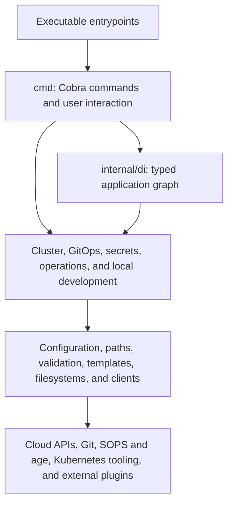

# Architecture

## System overview

openCenter CLI is a Go command-line application for managing declarative Kubernetes cluster configuration, generating GitOps workspaces, integrating encrypted secrets, and coordinating provider-specific lifecycle operations. The repository is a single Go module. Application code that is not an executable entrypoint lives under `internal/`; there is no intentionally external Go library surface under `pkg/`.

The architecture is layered around a thin command surface, an explicit application graph, domain packages, and focused infrastructure packages:



Dependencies should follow the arrows. Lower-level packages must not import `cmd`, and domain packages must not depend on executable wiring.

## Major commands and services

The primary executable is rooted at `main.go`. Its Cobra tree is assembled in `cmd/root.go` and exposes these main command groups:

- Cluster lifecycle, validation, GitOps generation, deployment, destruction, and provider synchronization.
- Settings and configuration inspection or mutation.
- Secret encryption, validation, key lifecycle, and synchronization.
- External plugin discovery and inspection.
- Version and shell-integration output.

`cmd/opencenter-local/main.go` is a separate local-development executable. It coordinates services used by the local environment rather than serving as the main CLI entrypoint.

The command layer owns argument parsing, prompts, presentation, exit behavior, and orchestration. Reusable domain behavior belongs in a specifically named `internal` package once its contract is stable. Commands should not become alternate service implementations.

## Major packages

| Package | Responsibility |
| --- | --- |
| `cmd` | Cobra command definitions, root wiring, user interaction, output selection, and external command plugin attachment. |
| `internal/di` | Construction of the typed `App` dependency graph and compatibility access through the legacy container interface. |
| `internal/config/v2` | Authoritative typed configuration model, loading, normalization, references, defaults, validation, and persistence coordination. |
| `internal/core/paths` | Low-level path resolution and repository filesystem layout. |
| `internal/core/validation` | Reusable validation engine and focused validators. |
| `internal/cluster` | Cluster lifecycle services and service-level result types. |
| `internal/cluster/orchestration` | Provider capability discovery, prompts, change review, and orchestration contracts. |
| `internal/cluster/provider/openstack`, `internal/cluster/storage/openstack` | Typed OpenStack provider planning and explicit one-service storage provisioning with persistence/recovery boundaries. |
| `internal/cloud` | Provider factory and shared provider-facing infrastructure types. |
| `internal/cloud/kind`, `internal/cloud/openstack`, `internal/cloud/vmware` | Provider-specific implementations and API integration. |
| `internal/gitops` | GitOps workspace generation, transactions, checkpoints, dry runs, and embedded assets. |
| `internal/gitops/stages` | Ordered generation-stage implementations. |
| `internal/template` | Template registry, rendering, composition, dependency resolution, and sandboxing. |
| `internal/secrets` | High-level secret management, registries, rotation, revocation, hooks, drift, and multi-cluster workflows. |
| `internal/sops` | Terminal-independent SOPS and age encryption, decryption, key management, and Git integration. |
| `internal/credentials` | Credential parsing and representation conversion. |
| `internal/operations` | Backup, recovery, drift detection, and scheduled operational workflows. |
| `internal/plugins` | Discovery and attachment of external executable plugins. |
| `internal/services` | Service plugin contracts, registry, metadata, and lifecycle descriptions. |
| `internal/services/descriptors` | Embedded service descriptor loading and typed descriptor data. |
| `internal/provision` | Provisioning templates and embedded provisioning assets. |
| `internal/tofu` | OpenTofu command integration. |
| `internal/localdev` | Local environment coordination with Flux, Gitea, API, and GitOps helpers. |
| `internal/ui` | Terminal-facing formatting and error presentation. |
| `internal/util/*` | Existing focused filesystem, file, crypto, error, metrics, and security primitives. This tree is not a destination for unrelated shared code. |

## Dependency direction

The intended direction is:

```text
main and local entrypoints
    -> cmd and local executable wiring
        -> internal/di for construction
        -> internal domain packages
            -> focused infrastructure packages
                -> external libraries, processes, and APIs
```

Rules:

- `internal` packages do not import `cmd`.
- Domain behavior does not live in `main.go`, Cobra constructors, or dependency providers.
- `internal/di` constructs components but does not own business rules.
- Provider packages implement provider contracts without importing command wiring.
- Consumer packages normally define the narrow interface they need.
- Shared code needs a specific concept name and a stable policy. Similar syntax alone is not enough to create a package.
- New general-purpose dumping grounds under `internal` or `pkg` are prohibited.

The typed `di.App` graph built by `di.NewApp` is the canonical runtime wiring path. `di.NewAppContainer` exposes that graph through the older `Container` interface for callers that have not migrated. Reflection-based registration through `di.SetupContainer` and `di.NewContainer` is a compatibility boundary; new dependencies should be explicit fields and constructor calls in the typed graph.

## Runtime flow

1. `main.go` installs build metadata and creates the compatibility bootstrap context.
2. `cmd.ExecuteWithContext` resolves an early configuration-directory override needed before plugin discovery.
3. `cmd/root.go` builds `di.App`, wraps it with the read-only container adapter, and installs both values in the command context.
4. Root command groups and discovered external plugins are attached to Cobra.
5. Cobra parses input and runs global option handling followed by the selected command.
6. The command resolves typed dependencies, coordinates a domain service, and renders output or returns a wrapped error.
7. The executable maps selected typed errors to process exit behavior and performs compatibility-container shutdown.

Keep constructors and wiring discoverable in `internal/di/app.go`, `internal/di/providers.go`, and `cmd/root.go`. Do not initialize hidden global service graphs from leaf packages.

## Configuration flow

The v2 model under `internal/config/v2` is authoritative. The broad processing flow is:

```mermaid
flowchart LR
    Input["CLI and environment path selection"] --> Read["Read YAML or JSON"]
    Read --> Decode["Decode typed v2 configuration"]
    Decode --> Normalize["Normalize supported legacy shapes"]
    Normalize --> Resolve["Resolve dynamic references"]
    Resolve --> Defaults["Apply defaults and hydration"]
    Defaults --> Validate["Validate structure and readiness"]
    Validate --> Use["Domain operation"]
    Use --> Persist["Explicit persistence when requested"]
```



Path policy belongs in configuration and path packages, not individual commands. Dynamic reference resolution can depend on environment variables, files, and external secret sources; changing ordering or fallback behavior is therefore a compatibility change. Configuration tags, defaults, normalization, reference syntax, and serialized shape are effective public APIs even though the Go package is internal.

## Data flow

The main durable data flow is configuration to generated GitOps content:

1. The configuration layer produces a validated typed model.
2. Cluster and provider packages enrich or synchronize provider-specific values.
3. Template and service registries select descriptors and embedded templates.
4. GitOps stages render into a workspace, using checkpoints, dry-run views, or transaction-style writes where the workflow requires them.
5. Secret values pass through `internal/secrets` and `internal/sops` before encrypted material is written.
6. Deployment and operational packages invoke external tools or APIs and record results, backups, or drift reports where applicable.

Ordering can be observable. In particular, SOPS overlay file selection, GitOps stage order, template precedence, reference resolution, and transaction boundaries must not be reordered without characterization tests.

## External integrations

Visible integration boundaries include:

- SOPS and age for encrypted configuration and key material.
- Git and external executable plugins.
- Kubernetes APIs and tools, Flux, Helm, and Kind.
- OpenStack services, including Barbican, plus VMware provider APIs.
- Gitea for local development.
- OpenTofu for infrastructure operations.
- Local filesystems, subprocesses, environment variables, and network endpoints.

Keep vendor-specific policy in the relevant provider or integration package. Wrap external failures with operation context, but preserve error classification when callers rely on it.

## Generated and embedded areas

There are currently no generated Go files marked with the standard generated-code header and no Go generation directives in the Go source tree. Several non-Go artifacts are derived or embedded and still require generated-boundary discipline:

- `schema/opencenter-v2.schema.json` is derived from the v2 configuration model.
- `docs/reference/opencenter/` is generated by `cmd/docs/generate.go`, which is selected with the tools build constraint. The generator also discovers external plugins, so output can depend on the host environment.
- `hack/generate_relaypoint_fixture_configs.go` generates fixture configuration.
- `cmd/shell-integration/`, `internal/services/descriptors/data/`, `internal/provision/templates/`, `internal/gitops/gitops-base-dir/`, and `internal/gitops/templates/` are compiled into binaries with embedding directives.
- Template test data is also embedded by integration tests.

Do not manually move generated or embedded files. Update their source and regeneration path together, then verify the embed pattern still matches. Some generation tasks in `.mise.toml` refer to removed or missing generation paths; repair and verify those tasks before treating them as authoritative.

## Testing strategy

Tests are colocated with packages and include unit, property, integration-style, and documentation-drift checks. The practical validation ladder is:

1. Run the directly changed package tests.
2. Run command tests when CLI text, docs, flags, or wiring change.
3. Run `go test ./...` for the complete default suite.
4. Run `go test ./internal/... ./cmd/... -count=1 -race` for concurrency-sensitive changes.
5. Run `go vet ./...` and configured lint checks.
6. Run `go mod tidy -diff` after dependency or import changes.

Property and scenario suites are useful for configuration, secrets, and lifecycle invariants. Generated or tools-tag code requires separate validation because it is not covered by the default package build. The documentation-drift test scans repository documentation, so examples must describe only supported command syntax.

## Operational concerns

- Configuration, state, keys, locks, backups, and generated workspaces have filesystem ownership and permission implications.
- Secret keys and decrypted values must not be logged or included in errors. Preserve masking and audit boundaries.
- External binaries and plugins are discovered dynamically; names, metadata, environment, checksums, and output behavior are compatibility surfaces.
- Provider and Kubernetes operations depend on credentials, network availability, remote API behavior, and retry classification.
- Drift scheduling and local-development services include goroutine and shutdown lifecycles. Changes need race testing and cancellation coverage.
- Dry-run behavior must avoid persistent writes and external mutation, not merely suppress final output.
- Embedded asset names and descriptor identifiers may be referenced dynamically and are not proven dead by Go call-graph analysis.
- Exit codes, output formats, configuration shape, filesystem layout, and plugin conventions are public behavior even when implemented under `internal`.
